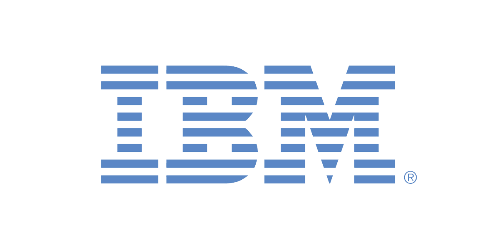

 

    

<h2 align="center"><i>Let's Create</i></h2> 

## Top Sponsors 

<!-- sponsors -->

    
    
    
    
    
    
    
    

<!-- /sponsors -->

<i>Do you want to show your ad here? Click [here](https://github.com/sponsors/D4Vinci/sponsorships?tier_id=435495) and enjoy the rest of the perks!</i>

## Key Features

### Spiders — A Full Crawling Framework
- 🕷️ **Scrapy-like Spider API**: Define spiders with `start_urls`, async `parse` callbacks, and `Request`/`Response` objects.
- ⚡ **Concurrent Crawling**: Configurable concurrency limits, per-domain throttling, and download delays.
- 🔄 **Multi-Session Support**: Unified interface for HTTP requests, and stealthy headless browsers in a single spider — route requests to different sessions by ID.
- 💾 **Pause & Resume**: Checkpoint-based crawl persistence. Press Ctrl+C for a graceful shutdown; restart to resume from where you left off.
- 📡 **Streaming Mode**: Stream scraped items as they arrive via `async for item in spider.stream()` with real-time stats — ideal for UI, pipelines, and long-running crawls.
- 🛡️ **Blocked Request Detection**: Automatic detection and retry of blocked requests with customizable logic.
- 📦 **Built-in Export**: Export results through hooks and your own pipeline or the built-in JSON/JSONL with `result.items.to_json()` / `result.items.to_jsonl()` respectively.

### Advanced Websites Fetching with Session Support
- **HTTP Requests**: Fast and stealthy HTTP requests with the `Fetcher` class. Can impersonate browsers' TLS fingerprint, headers, and use HTTP/3.
- **Dynamic Loading**: Fetch dynamic websites with full browser automation through the `DynamicFetcher` class supporting Playwright's Chromium and Google's Chrome.
- **Anti-bot Bypass**: Advanced stealth capabilities with `StealthyFetcher` and fingerprint spoofing. Can easily bypass all types of Cloudflare's Turnstile/Interstitial with automation.
- **Session Management**: Persistent session support with `FetcherSession`, `StealthySession`, and `DynamicSession` classes for cookie and state management across requests.
- **Proxy Rotation**: Built-in `ProxyRotator` with cyclic or custom rotation strategies across all session types, plus per-request proxy overrides.
- **Domain Blocking**: Block requests to specific domains (and their subdomains) in browser-based fetchers.
- **Async Support**: Complete async support across all fetchers and dedicated async session classes.

### Adaptive Scraping & AI Integration
- 🔄 **Smart Element Tracking**: Relocate elements after website changes using intelligent similarity algorithms.
- 🎯 **Smart Flexible Selection**: CSS selectors, XPath selectors, filter-based search, text search, regex search, and more.
- 🔍 **Find Similar Elements**: Automatically locate elements similar to found elements.
- 🤖 **MCP Server to be used with AI**: Built-in MCP server for AI-assisted Web Scraping and data extraction. The MCP server features powerful, custom capabilities that leverage Scrapling to extract targeted content before passing it to the AI (Claude/Cursor/etc), thereby speeding up operations and reducing costs by minimizing token usage. ([demo video](https://www.youtube.com/watch?v=qyFk3ZNwOxE))

### High-Performance & battle-tested Architecture
- 🚀 **Lightning Fast**: Optimized performance outperforming most Python scraping libraries.
- 🔋 **Memory Efficient**: Optimized data structures and lazy loading for a minimal memory footprint.
- ⚡ **Fast JSON Serialization**: 10x faster than the standard library.
- 🏗️ **Battle tested**: Not only does Scrapling have 92% test coverage and full type hints coverage, but it has been used daily by hundreds of Web Scrapers over the past year.

### Developer/Web Scraper Friendly Experience
- 🎯 **Interactive Web Scraping Shell**: Optional built-in IPython shell with Scrapling integration, shortcuts, and new tools to speed up Web Scraping scripts development, like converting curl requests to Scrapling requests and viewing requests results in your browser.
- 🚀 **Use it directly from the Terminal**: Optionally, you can use Scrapling to scrape a URL without writing a single line of code!
- 🛠️ **Rich Navigation API**: Advanced DOM traversal with parent, sibling, and child navigation methods.
- 🧬 **Enhanced Text Processing**: Built-in regex, cleaning methods, and optimized string operations.
- 📝 **Auto Selector Generation**: Generate robust CSS/XPath selectors for any element.
- 🔌 **Familiar API**: Similar to Scrapy/BeautifulSoup with the same pseudo-elements used in Scrapy/Parsel.
- 📘 **Complete Type Coverage**: Full type hints for excellent IDE support and code completion. The entire codebase is automatically scanned with **PyRight** and **MyPy** with each change.
- 🔋 **Ready Docker image**: With each release, a Docker image containing all browsers is automatically built and pushed.

